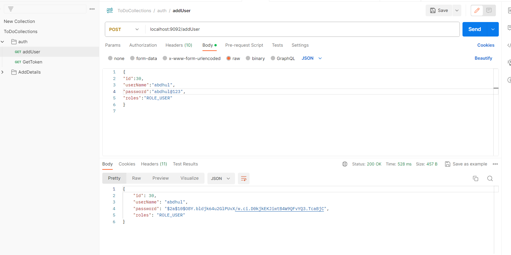
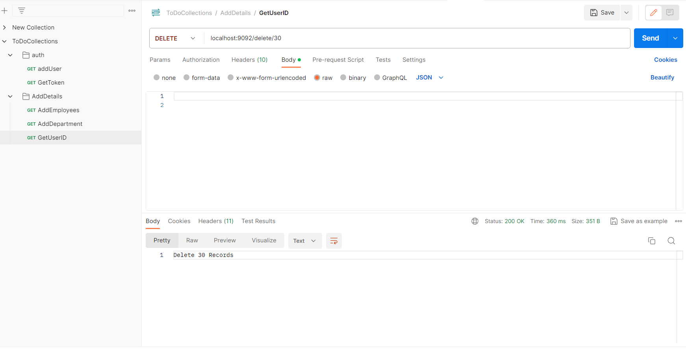
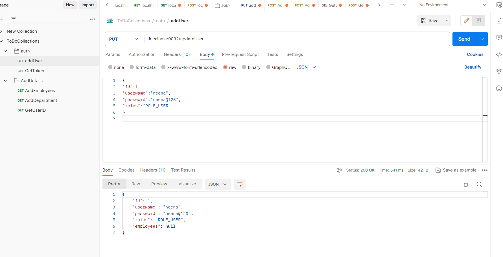

# Employee Management Application

This is a simple employee management application built with Java, Spring Boot, and Hibernate. The application allows you to perform CRUD operations on employees, and each employee is associated with a user ID and password for authentication. Additionally, the application features department and address tables associated with the employees table.

## Features

- User authentication based on user ID and password
- Add new employees
- Delete existing employees, Update employee information
- Department and address tables associated with employees
- Record timestamp for update, delete, and create operations

## Technologies Used

- Java
- Spring Boot
- SpringShell
- SpringDataJpa
- SpringSecurity
- Hibernate
- JWT Authentication

## Getting Started

### Prerequisites

- Java Development Kit (JDK)
- Maven
- Your preferred Integrated Development Environment (IDE)

### Installation

1. Clone the repository:

   ```bash
   git clone https://github.com/kncjknc/TODOforG-G

## Api Endpoints

### Add User

**Endpoint:** `POST /api/addUser`
- Json Body :
``` json 
{
  "id":1,
  "userName":"jhon@gmail.com",
  "password":"jhon",
  "roles":"ROLE_USER"
  }
```




### Add Employee 

**Endpoint:** `POST /api/addEmployee`
- Json Body :
``` json 
{
"employeeId":2,
"employeeName":"Girisha",
"employeeAge":"20",
"employeeSalary":"20000",
"department":{
    "departmentId":1,
    "departmentName":"IT",
    "departmentManager":"Srii"
},
"users":{
"id":8,
"userName":"Girisha",
"password":"Girisha@123",
"roles":"admin"
},
"address":{
    "addressId":8,
    "address1":"No:09",
    "address2":null,
    "postalCode":"600541"
}
}

```


### DeleteUser

**EndPoint :** `Delete api/Delete/{id}`



### Update User

**EndPoint :** `Update api/updateUser`

- Json Body :
```json
{
"id":1,
"userName":"sriya",
"password":"sriya",
"roles":"ROLE_USER"
}
```



- Note : Make sure the Update json body id existing one.

## Basic Auth in Spring Boot

- Basic Authentication in Spring Boot is a simple authentication mechanism where the client sends a username and password as part of the HTTP request headers. This information is then used by the server to authenticate the user

- dependency

```dependency
<dependency>
        <groupId>org.springframework.boot</groupId>
        <artifactId>spring-boot-starter-security</artifactId>
    </dependency>
```
- Configuration

```json

@Configuration
@EnableWebSecurity
@EnableMethodSecurity(prePostEnabled = true)
public class SecurityConfigure {

   
    @Bean
    UserDetailsService userDeailService() {
        return new UserInfoService();
    }

    @Bean
    PasswordEncoder passwordEncoder() {
        return new BCryptPasswordEncoder();
    }

    @Bean
   public SecurityFilterChain securityFilterChain(HttpSecurity http) throws Exception {

   http.authorizeHttpRequests(expressionInterceptUrlRegistry ->
   expressionInterceptUrlRegistry.requestMatchers("/securityNone").permitAll()
   .anyRequest().authenticated())
   .httpBasic(httpSecurityHttpBasicConfigurer -> httpSecurityHttpBasicConfigurer.authenticationEntryPoint(authenticationEntryPoint));
   http.addFilterAfter(new CustomFilter(), BasicAuthenticationFilter.class);
   return http.build();
    }
}
```
